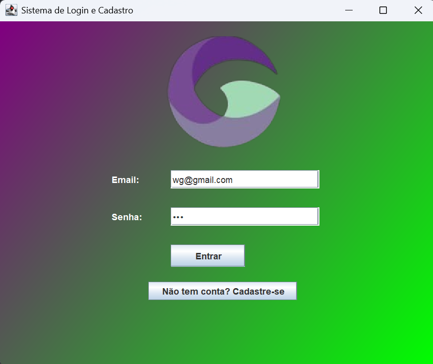
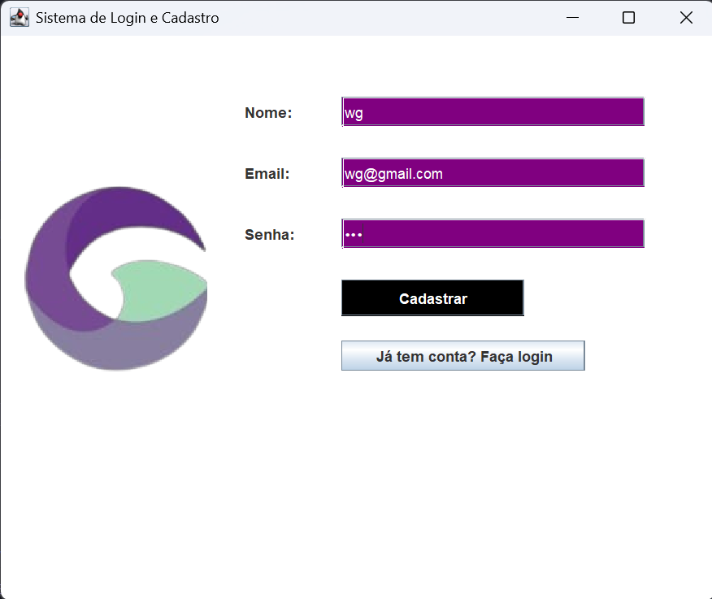

# 🔐 Sistema de Login em Java (Trabalho da faculdade)

Este é um projeto de **Sistema de Login** desenvolvido em **Java**, com o objetivo de fornecer uma estrutura simples e funcional para autenticação de usuários.

## 🚀 Funcionalidades

- Cadastro de novos usuários
- Login com verificação de credenciais

## 🛠 Tecnologias Utilizadas

- **Java** 
- **IDE recomendada**: NetBeans /  VS Code

## 🖥️ Interface Gráfica 

